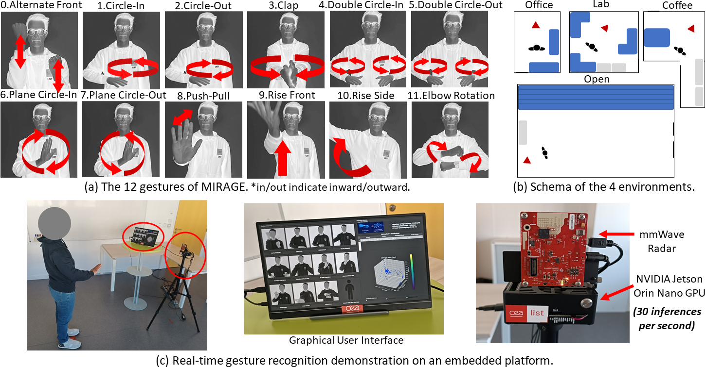

# Lightweight and Robust Embedded Radar-based Gesture Recognition with Graph Neural Networks

This repository contains the official implementation for the paper:

**Lightweight and Robust Embedded Radar-based Gesture Recognition with Graph Neural Networks**,
Manon Dampfhoffer, Umberto Pirovano, Régis Chanal,
*Proceedings of the Computer Vision and Pattern Recognition Conference Workshops (CVPRW) 2026*
**[Paper](TODO)** [TODO]


-----

## 📄 Citation [TODO]

If you find our work useful in your research, please consider citing our paper:

```bibtex
@inproceedings{TODO
}
```

-----

## 📜 License [TODO]

This project is licensed under the MIT license.

## 📝 Abstract

Millimeter-wave radars are increasingly being used for privacy-preserving and robust gesture and human activity recognition on edge systems. However, current works do not exploit the full potential of radar-specific point cloud features, such as velocity, intensity and frame timestamp. Moreover, they are only evaluated in clean environments, and often do not meet the requirements of embedded hardware. In this work, we propose an end-to-end methodology for accurate, lightweight and robust gesture and human activity recognition on embedded hardware. We introduce a dataset, MIRAGE (Multi-person Interference RAdar GEsture), designed to assess the importance of radar-specific features, as well as robustness evaluation in realistic scenarios. We propose a Graph Neural Network (GNN) architecture efficiently integrating radar features, and compare it with CNN and Transformer. Our GNN outperforms the state-of-the-art with the highest accuracy and the lowest parameters count, number of operations and memory usage. We showcase a real-time live demonstration on a NVIDIA Jetson Orin Nano GPU. We provide the dataset and code.

-----

## 🛠️ Installation

The project is inspired from [MiliPoint](https://github.com/yizzfz/MiliPoint/tree/main) code repository.

This project was created with Python 3.10, Pytorch 2.4.1 with cuda 11.8, using the **Pytorch geometric** library (required for the GNN) with packages torch-scatter 2.1.2 and torch-cluster 1.6.3. It can be installed using the `requirements.txt` file provided. If the install does not work, you can install the packages manually by following these steps (using conda and pip):
```bash
# create a conda environment with python 3.10:
conda create -n myenv -c conda-forge python=3.10
# activate the conda environment:
conda activate myenv
# install pytorch with the appropriate cuda version:
pip install torch==2.4.1+cu118 torchvision --index-url https://download.pytorch.org/whl/cu118
# install other packages
pip install toml matplotlib seaborn scipy opencv-python optuna pytorch_lightning scikit-learn tensorboard pulp ptflops torch_geometric
# install the required packages for pytorch geometric compatible with the appropriate torch and cuda version:
pip install torch-scatter==2.1.2 torch-cluster==1.6.3 --index-url https://data.pyg.org/whl/torch-2.4.1+cu118.html 
# Note: if this does not work, try to download and directly install the wheel with the appropriate python version and linux support: torch_scatter-2.1.2+pt24cu118-cp310-cp310-linux_x86_64.whl and torch_cluster-1.6.3+pt24cu118-cp310-cp310-linux_x86_64.whl (downloaded from https://data.pyg.org/whl/torch-2.4.1+cu118.html)
```

-----

## 💾 Datasets

### MIRAGE: a Multi-person Interference RAdar GEsture dataset



The raw data of MIRAGE dataset are provided in `data/MIRAGE/raw`. The data are split in `Train` (Coffee, Office, Open environments) and `Test` (Lab environment) sets, each organized with the following structure: `environment/subject/gesture/sample.txt`.

The processed data (created by the training and testing scripts) are stored in `data/MIRAGE/processed`. The data are recorded with a TI IWR1843Boost mmWave radar (Frequency-Modulated Continuous Wave, working in the 76-81GHz range with four receiver and three transmitter antennas). The point clouds contain spatial coordinates (x,y,z in meters), radial velocity (meters/second), intensity (dB), and a frame timestamp. It is configured to produce 30 frames per second, with a CFAR threshold of 15dB, maximum range of 6m, range resolution of 0.044m, maximum radial velocity of 2.4m/s and radial velocity resolution of 0.33m/s. The configuration file used for the radar is provided in `data/MIRAGE/raw/TI1843_3d_30hz.cfg` The participants perform the gestures in front of the radar (positioned at 124cm high) at about 1.5m distance. 

### mmActivity (RadHAR)

The RadHAR dataset can be obtained through the [RadHAR](https://github.com/nesl/RadHAR/tree/master) repository.


-----

## 🚀 Training

### Training and testing a model

The hyperparameters used in these experiments are defined, and can be directly modified, in the config file of the dataset (`configs/mirage.toml` for MIRAGE dataset). They can also be modified via the command line (see arguments in `cli.py`). In particular, the choice of radar features is a parameter of interest in our study. They can be defined with the parameters: `dataset_input_features`, `dataset_posconv_features`, `dataset_posgraph_features`; corresponding respectively to $\mathbf{X}$, $\mathbf{E}$, $\mathbf{D}$ variables from the paper (see Section 3.2). Note that only `dataset_input_features` is used for CNN and Transformer models.

To train a model, use:

```bash
python mm train mirage pointnet_tiny -config configs/mirage.toml -d_kfold 0 -seed 0 -d_processed_data data/MIRAGE/processed/kfold0.pkl
```
will train the pointnet_tiny model on MIRAGE dataset. If `-d_processed_data` filepath (containing the preprocessed data) does not exist, it creates it. Note that `-d_kfold` specifies the split to use for kfold validation (a different pkl file must be created for each split). If not specified, no kfold validation is applied (Test split is used as validation).

To test a trained model, use:

```bash
python mm test mirage pointnet_tiny -config configs/mirage.toml -d_processed_data data/MIRAGE/processed/kfold0.pkl --load lightning_logs/version_0
```

where `lightning_logs/version_0` is the repository containing the checkpoint of the pretrained model (file `best.pth`). 

Note that training and testing can be performed in a similar way on mmActivity dataset (radhar), e.g:

```bash
python mm train radhar pointnet_tiny -config configs/radhar.toml -d_kfold 0 -seed 0 -d_processed_data data/radhar/processed/kfold0.pkl
```

### Scripts to reproduce the results

The following scripts allow to reproduce the results of the paper on MIRAGE dataset. All scripts can also be ran at once by executing `./mirage_all.sh`, which takes approximately 73 hours on a single A100 GPU (with 8 processes).

The scripts must be ran from the root directory of this repository. 
They produce the results using kfold (k=5) cross-validation in `lightning_logs\[experiment_name]\tuning_[kfold_id]\version_[config_id]`. The best model is saved in `best.ckpt`, the configuration of the experiment (version) is saved in `hparams.yaml`. For each experiment, a summary of the results is stored in `summary_results.csv` containing the results averaged over all kfold. 

Note: the results indicated in the paper correspond to validation accuracy, except for the results in Table 1 corresponding to test accuracy of the best configuration for each model for each dataset found in the ablations. Be aware that, even when using a seed, some non-deterministic behaviors remain, resulting in a small variability between runs. 
Note: since the publication of the paper, an error in the code has been corrected, impacting the results for the CNN model when the feature "time" was included. 

**Integration of radar dimensions in the GNN (Table 5 of the paper):**

```bash
./mirage_gnn_features_ablation.sh
```

**Impact of radar dimensions across models (Table 6 of the paper):**

```bash
./mirage_models_features_ablation.sh
```

**Noise (multi-person interference) robustness  (Table 7 & 8 of the paper):**

To get results with the "clean" training setting (training, validation and test with the clean samples only):

```bash
./mirage_clean_training.sh
```

Then, to obtain the validation separately on clean and noisy settings, run the following script:

```bash
./mirage_clean_noisy_validation.sh
```

Note: This script runs evaluation of the models trained with the "clean" setting (therefore must be ran after `./mirage_clean_training.sh`) and on the models trained with the "clean+noisy" setting (therefore must be ran after `./mirage_models_features_ablation.sh`). It creates a summary of the results in `summary_results_valnoisy.csv` and `summary_results_valclean.csv` for the results on validation set on noisy and clean samples respectively (note: only `summary_results_valnoisy.csv` is produced for the models trained with clean training, because the validation is already performed on clean-only samples during the training phase and hence appears in `summary_results.csv`).


**Spatio-temporal distances in GNN (Figure 5):**

```bash
./mirage_gnn_tscale_ablation.sh
```

-----

**mmActivity dataset:**

Similar scripts (`mirage_gnn_features_ablation.sh`, `mirage_models_features_ablation.sh`, `mirage_gnn_tscale_ablation.sh`) can be created to get results on mmActivity dataset (radhar) by simply replacing `mirage` by `radhar` in the script. Only the noise robustness experiments cannot be ran, due to the absence of noisy data in mmActivity.